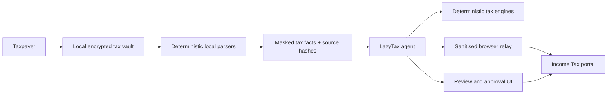

# LazyTax pivot: the secure CA babysitter

Date: 19 July 2026

## Product decision

LazyTax is no longer positioned as a tax-verification tool that waits for a
perfectly scoped evidence set. It is a filing companion that behaves like a
careful, experienced chartered accountant:

1. accept the real documents the taxpayer already has;
2. extract and consolidate everything possible without asking the taxpayer to
   repeat facts already present in evidence;
3. collect likely missing income from authoritative sources;
4. calculate supported portions immediately and keep a visible open-items
   ledger for the rest;
5. walk the taxpayer through review, portal submission and e-verification; and
6. never take an irreversible action without an explicit, contextual approval.

The user job is:

> When tax filing feels fragmented and risky, stay with me, find what is
> missing, explain the few decisions only I can make, and get me safely from
> documents to acknowledgement.

## What failed in the old experience

The reviewed interaction demonstrated useful technical work—binary duplicate
detection, multi-employer consolidation, one-time standard deduction and TDS
reconciliation—but presented every unknown as a blocker. It then asked the
taxpayer whether crypto, foreign assets and deductions existed instead of first
offering to collect AIS, Form 26AS, prefill and broker evidence.

The root problem was not tone. The workflow optimized for avoiding an incorrect
claim rather than completing the taxpayer's job.

## Progressive-certainty operating model

Every session maintains four independent states:

- **Known and evidenced**: usable now, with a source locator.
- **Automatically discoverable**: LazyTax fetches or guides collection before
  asking the taxpayer.
- **User-known only**: one compact question after automatic sources are
  exhausted—for example cash rent, a private wallet, or an overseas account.
- **Needs specialist review**: LazyTax prepares the evidence and explains the
  consequence; it does not discard the rest of the return.

An unknown blocks only the calculation or action it can materially change. It
does not block document intake, duplicate detection, source collection,
reconciliation, supported calculations, or preparation of the rest of the
return.

## Conversation contract

- Lead with work completed and money-impacting findings.
- Do not repeat a legal disclaimer on every turn.
- Do not use a seven-heading incident report for ordinary conversation.
- Never ask for facts already available in an authorized document or source.
- Before asking a question, attempt the available local extraction,
  deterministic tool, connected source, or user-supervised portal workflow.
- Ask at most three tightly related questions in one turn, with a short reason
  each matters.
- Offer a recommended next step and continue autonomously with every safe task
  that does not require the answer.
- Maintain one concise checklist: done, being collected, needs you, final
  approval.
- Explain uncertainty as impact: “This could change tax by …” or “This affects
  Schedule …”, not as a generic scope refusal.
- A protected-document password is entered in a local secret field outside
  chat. Portal passwords, OTPs, EVCs, private keys and seed phrases are never
  placed in chat or retained by LazyTax.

## Filing rails

### Rail A — local concierge beta

The taxpayer signs in themselves in a controlled local browser. LazyTax can
navigate and collect permitted tax documents after sign-in, but the taxpayer
enters credentials and OTPs directly and approves downloads, payments,
submission and e-verification. The agent receives masked task state rather than
raw credentials or unrestricted browser history.

This is a private-beta bridge, not the long-term integration contract.

### Rail B — registered ERI

Production filing should use the Income Tax Department's e-Return Intermediary
path. Type-2 ERIs may build software against department APIs; Add Client and
Prefill require taxpayer consent, and the official API family covers prefill,
validation/submission, e-verification and acknowledgement.

Official references:

- [Income Tax Department ERI API specifications](https://www.incometax.gov.in/iec/foportal/api-specifications)
- [Income Tax Department ERI registration](https://www.incometax.gov.in/iec/foportal/help/eri/registration)
- [Taxpayer verification of ERI service requests](https://www.incometax.gov.in/iec/foportal/help/verifyservicerequestofERIs)

Do not market “one-click filing” until LazyTax is registered and the relevant
APIs have passed production certification.

## Secure real-data architecture

### Local vault

- Generate a random data-encryption key per document and encrypt with
  AES-256-GCM or an equivalent authenticated cipher.
- Wrap document keys with a device-bound key held by macOS Keychain/Secure
  Enclave, Windows DPAPI/TPM, or the platform key store.
- Keep PDF passwords in a native/local secret-entry control and memory only.
- Prefer streaming decryption into parsers. If a library requires plaintext,
  use an isolated per-session directory with restrictive permissions and
  guaranteed cleanup.
- Store structured facts in an encrypted local database. Store PAN/account
  display forms as masked values; keep full identifiers only where a filing
  schema strictly requires them.
- Disable cloud backup by default. If enabled, use client-side encryption whose
  wrapping key is unavailable to the storage provider.

### Model and tool boundary

- Raw documents do not enter prompts, analytics, traces or support tooling.
- Local parsers treat document text as untrusted data and cannot execute
  instructions embedded in PDFs or spreadsheets.
- The model receives tax-relevant structured facts, confidence, masked entity
  labels and source hashes.
- MCP tools expose least-privilege, task-specific operations. No generic
  filesystem, shell, database or unrestricted browser tool is part of the
  public plugin.
- Tool outputs are scanned for PAN, Aadhaar, account, credential and high-risk
  free-text patterns before leaving the local boundary.

### Browser and government actions

- Allowlist official Income Tax Department domains and pin navigation to the
  authenticated top-level origin.
- Use a dedicated browser profile with no unrelated history, extensions,
  cookies or saved passwords.
- Credentials and OTPs are typed by the taxpayer into the real origin; they are
  never exposed to the agent or recorded.
- Redact PAN, Aadhaar, bank and contact fields from DOM/screenshot state before
  it reaches the model whenever technically possible.
- Require explicit approval immediately before submit, payment, e-verification,
  profile changes or any other consequential action.
- Record an append-only local audit event containing action, source hash,
  timestamp and approval—not secrets or full document content.

### Hosted services

- India-region deployment where supported, tenant isolation, private object
  storage, KMS/HSM-backed envelope encryption and short-lived scoped access.
- Separate identity, document, tax-fact and audit services; deny cross-tenant
  reads at both application and database layers.
- No document content, amounts, prompts, identifiers or browser captures in
  PostHog/Sentry/logs. Analytics remains consented metadata-only.
- Malware scanning, content-type verification, parser sandboxing, dependency
  pinning, SBOM, secret scanning, rate limits and abuse monitoring.
- Documented key rotation, deletion, backup restoration and breach-response
  runbooks; regular independent penetration tests before a real-taxpayer public
  launch.

## Compliance position

Proceed with conditions and qualified Indian privacy/tax counsel review.

- The currently applicable IT Act SPDI framework treats passwords and financial
  information as sensitive personal data and requires a published privacy
  policy, consent/purpose discipline and reasonable security practices.
- The DPDP Act/Rules rollout is phased. As of 19 July 2026, the substantive
  Data Fiduciary rules scheduled eighteen months after the 13 November 2025
  Gazette are not yet effective, but LazyTax should build to them now.
- The 2025 Rules require clear itemised notices, encryption/masking, access
  control, monitoring, backups, processor contracts and breach response; they
  also create retention obligations that must be reconciled with deletion
  promises.
- CERT-In directions apply as applicable to body corporates and require cyber
  incident reporting and log practices. The incident runbook must reconcile
  CERT-In and DPDP notification timelines.
- Government prefill/submission should use ERI authorization and consent rather
  than credential collection or an undocumented scraping dependency.

Official references:

- [Digital Personal Data Protection Act, 2023](https://www.meity.gov.in/static/uploads/2024/02/Digital-Personal-Data-Protection-Act-2023.pdf)
- [Digital Personal Data Protection Rules, 2025](https://www.meity.gov.in/static/uploads/2025/11/53450e6e5dc0bfa85ebd78686cadad39.pdf)
- [IT SPDI Rules, 2011](https://www.meity.gov.in/sites/upload_files/dit/files/RNUS_CyberLaw_15411.pdf)
- [CERT-In directions under section 70B](https://www.cert-in.org.in/PDF/CERT-In_Directions_70B_28.04.2022.pdf)
- [Income Tax portal website policies](https://www.incometax.gov.in/iec/foportal/using-the-portal/webSitePolicies)

## Trust claims allowed at each stage

| Stage | Claim allowed |
|---|---|
| Current local plugin | Local deterministic preparation with masked outputs; no automatic filing |
| Encrypted-vault beta | Raw files encrypted locally; credentials never possessed; supervised portal assistance |
| Audited hosted beta | Independently tested controls, documented processors, incident/deletion operations |
| Registered ERI | Consented prefill and submission through official department interfaces |

Never claim “unhackable”, “DPDP certified”, “bank-grade” or “zero knowledge”
without a precise architecture, independent evidence and legal review.

## Success measures

- Median user questions before first full-year estimate: at most three.
- At least 80% of source collection completed by extraction or guided fetch,
  not manual retyping.
- Every session shows useful progress before requesting user input.
- Zero credentials or OTPs in prompts, logs, traces or stored records.
- 100% explicit approval coverage for submission/payment/e-verification.
- At least 80% of concierge-beta users reach a reviewed ITR draft unaided.
